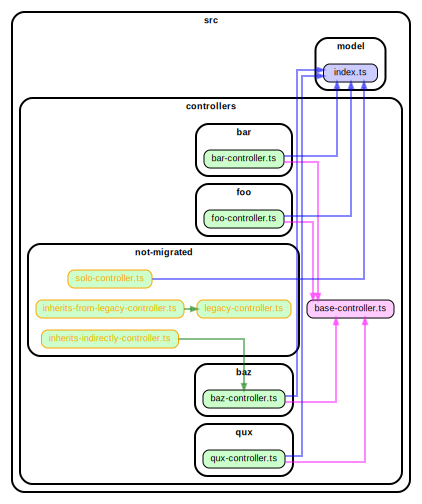
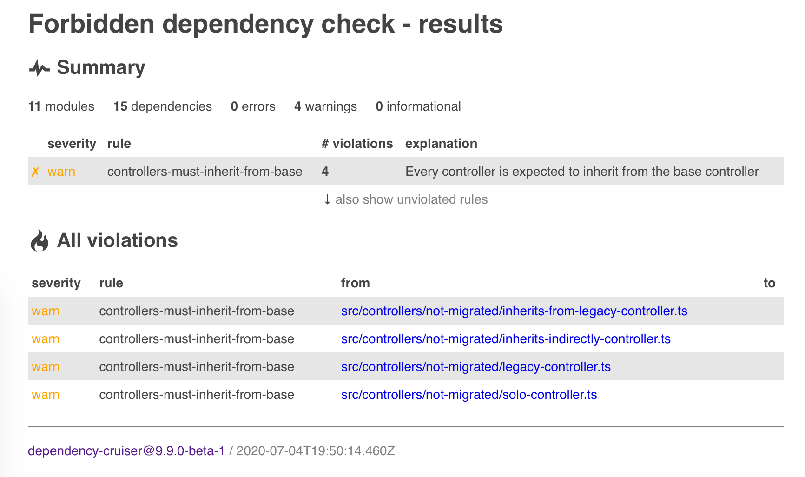

# dependency-cruiser issue #328

This folder contains a basic demo for a feature to enable rules
that require a certain dependency to be there, e.g. _all controllers should
depend on the base controller_.

## dot reporter

```
npm run depcruise:graph
```



## err reporter

```
npm run depcruise
```

```
  warn controllers-must-inherit-from-base: src/controllers/not-migrated/solo-controller.ts
  warn controllers-must-inherit-from-base: src/controllers/not-migrated/legacy-controller.ts
  warn controllers-must-inherit-from-base: src/controllers/not-migrated/inherits-indirectly-controller.ts
  warn controllers-must-inherit-from-base: src/controllers/not-migrated/inherits-from-legacy-controller.ts

✖ 4 dependency violations (0 errors, 4 warnings). 11 modules, 15 dependencies cruised.
```

## err-html reporter

```
npm run depcruise:html
```


