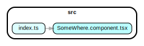

install: `npm install`

`npm run depcruise:graph` generates output/dependency-graph.svg



`npm run depcruise:text` prints all dependencies to stdout in a short format

```
src/index.ts → src/SomeWhere.component.tsx
```

`npm run depcruise:json` emits the dependency-tree in json format to [output/graph-output.json](output/graph-output.json)
