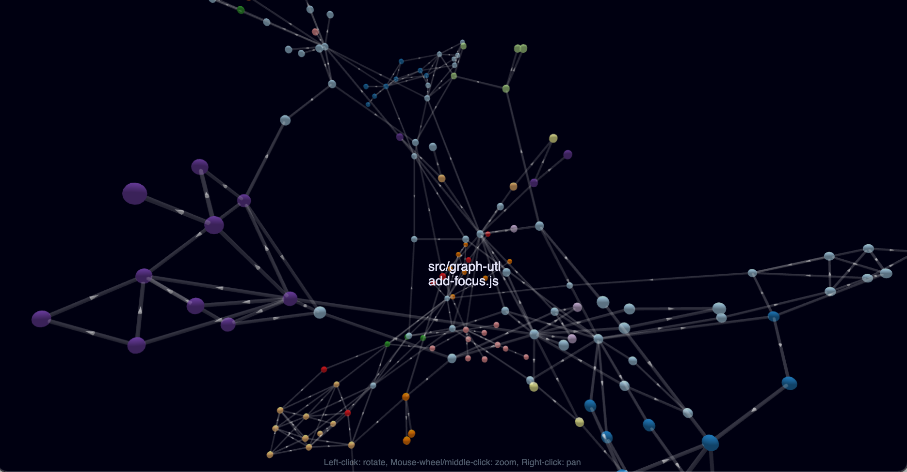

# Demo: 3D graph reporter plugin for dependency-cruiser (issue [#458](https://github.com/sverweij/dependency-cruiser/issues/458))

[](./dependency-cruiser-bald-nodes.png)

Plugin source here: [./3d-reporter-plugin.js](./3d-reporter-plugin.js)

Usage:

- copy the plugin to a convenient spot (I've put it in the same folder as I have run the samples from)
- pass the full path in the `--output-type` option with a `plugin:` prefix. (You can use something like `$(pwd)` or specify fully like so: `--output-type plugin:/Users/jdoe/bigproject/3d-reporter-plugin.js`).
- run it

## sample: dependency-cruiser

```sh
# for 'local' plugins we need to specify the absolute path
npx depcruise bin --include-only "^(bin|src)" --output-type plugin:$(pwd)/3d-reporter-plugin.js > 3d-graph.html
```

Results (interactive html):

- [dependency-cruiser internal graph - nodes are 'bald'](./dependency-cruiser-src-bald-nodes.html)
- [dependency-cruiser's internal graph - nodes are text labels](./dependency-cruiser-src-text-nodes)

## sample: react

```sh
# again: specify absolte path to the plugin
npx depcruise packages --include-only "^(packages)" --output-type plugin:$(pwd)/3d-reporter-plugin.js > 3d-graph.html
```

Result (interactive html): [react's module graph - nodes are 'bald'](./react-packages-bald-nodes.html). Warning: > 4000 modules and > 10000 dependencies in 4Mb of html.
