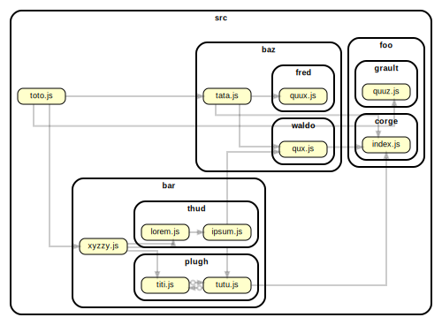
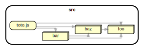

### Input

Given this source tree ...

```
src
├── bar
│   ├── plugh
│   │   ├── titi.js
│   │   └── tutu.js
│   ├── thud
│   │   ├── ipsum.js
│   │   └── lorem.js
│   └── xyzzy.js
├── baz
│   ├── fred
│   │   └── quux.js
│   ├── tata.js
│   └── waldo
│       └── qux.js
├── foo
│   ├── corge
│   │   └── index.js
│   └── grault
│       └── quuz.js
└── toto.js
```

### Complete graph

This would be the output of all (see the [depcruise:graph run script in package.json](https://github.com/sverweij/dependency-cruiser-repro-repo/tree/main/462/package.json#L6)).
Click on the graph for a slightly more interactive version.

[](https://sverweij.github.io/dependency-cruiser-repro-repo/462/dependency-graph.html)

### Summarized to the first level below ^src

This would be the output with the `collapse` feature engaged; either using the `--collapse` command line parameter, or with (see the [depcruise:graph-archi](https://github.com/sverweij/dependency-cruiser-repro-repo/tree/main/462/package.json#L7) and [depcruise:graph-with-collapse-command-line-switch](https://github.com/sverweij/dependency-cruiser-repro-repo/tree/main/462/package.json#L8) run script in package.json)

Click on the graph for a slightly more interactive version.

[](https://sverweij.github.io/dependency-cruiser-repro-repo/462/high-level-dependency-graph.html)
