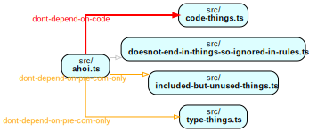

## reproduction sample for issue #490



To reproduce this graph: `npm i` and then run `npm run depcruise:graph`.

To see all violations specified in the config file run `npm run depcruise`,
which will yield something like this:

```
  info dont-depend-on-pre-com-only: src/ahoi.ts → src/type-things.ts
  info dont-depend-on-pre-com-only: src/ahoi.ts → src/included-but-unused-things.ts
  warn dont-depend-on-wherever: src/ahoi.ts → src/type-things.ts
  warn dont-depend-on-wherever: src/ahoi.ts → src/included-but-unused-things.ts
  warn dont-depend-on-wherever: src/ahoi.ts → src/code-things.ts
  error dont-depend-on-code: src/ahoi.ts → src/code-things.ts

✖ 6 dependency violations (1 errors, 3 warnings). 5 modules, 4 dependencies cruised.
```
