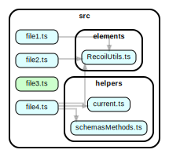

Minimal repro repo for https://github.com/sverweij/dependency-cruiser/issues/523#issuecomment-970281571

## running this

After installing all dependencies (e.g. with `npm install`):

- `npm run build` generates the two graphs
- `npm run depcruise:metrics:all` and `npm run depcruise:metrics:src` run the metrics reporter over all dependencies and those in `src` only respectively.

## all dependencies

[](https://sverweij.github.io/dependency-cruiser-repro-repo/523/everything.html)

```shell
$ depcruise src --config --output-type metrics
folder           N    Ca    Ce  I
------------ ----- ----- -----  -----
src              7     0     4  1
src/elements     1     3     0  0
src/helpers      2     2     0  0
```

## ^src only

[](https://sverweij.github.io/dependency-cruiser-repro-repo/523/src-only.html)

```shell
$ depcruise src --include-only '^src' --config --output-type metrics
folder           N    Ca    Ce  I
------------ ----- ----- -----  -----
src              7     0     0  0
src/elements     1     3     0  0
src/helpers      2     2     0  0
```
