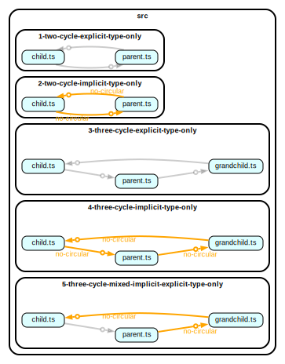

## reproduction sample for issue [#695](https://github.com/sverweij/dependency-cruiser/issues/695)

Run `npm i` to install and then

- `npm run depcruise:graph` to produce the graph below

Other commands:

- `npm run depcruise` - to only validate
- `npm run depcruise:json` - to dump the data model of the cruise
