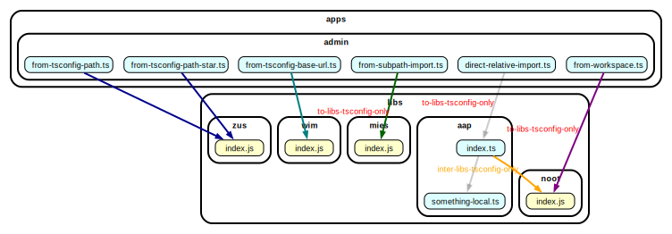

## reproduction example for [#863](https://github.com/sverweij/dependency-cruiser/issues/863)



### installing & running

- git clone dependency-cruiser-repro-repo
- `cd dependency-cruiser-repro-repo/863`
- `npm install`
- run `npx depcruise apps libs`

This should emit warnings/ errors for everything that goes into libs, but isn't
a `alias-tsconfig` import, and for inter-lib dependencies that aren't `alias-tsconfig`'s

```

warn inter-libs-tsconfig-only: libs/aap/index.ts → libs/noot/index.js
error to-libs-tsconfig-only: apps/admin/from-workspace.ts → libs/noot/index.js
error to-libs-tsconfig-only: apps/admin/from-subpath-import.ts → libs/mies/index.js
error to-libs-tsconfig-only: apps/admin/direct-relative-import.ts → libs/aap/index.ts

✘ 4 dependency violations (3 errors, 1 warnings). 12 modules, 8 dependencies cruised.

```

- To get the graph run `npx depcruise apps libs --output-type dot | dot -Tsvg > dependency-graph.svg`
- To see how dependency-cruiser is interpreting things run
  `npx depcruise apps libs --output-type json > dependency-graph.json` and
  inspect the `dependencyTypes` property of each of the dependencies in the
  `dependencies` arrays of the resulting [dependency-graph.json](./dependency-graph.json)

### background

This folder contains a tiny monorepo with an `apps` folder (with only one app) and
a few dummy libraries in the `libs` folder. Rules in
[.dependency-cruiser.js](./.dependency-cruiser.js) are set up so as to mimic the
requirements lined out in issue 863.

Each typescript source in the `apps/admin` folder imports a library via an other
type of alias, denoted by their file name (e.g. `from-tsconfig-path` imports
`zus/index.js`) by way of the `paths` section in the `tsconfig.json` file.

The `aliased-tsconfig-paths` and `aliased-tsconfig-base-url` dependencyTypes are
new in dependency-cruiser@16, but you can still use `alias-tsconfig`, which will
include _both_ of the new types.

> ### About the graph at the top of this README
>
> The graph has some colors to visually verify dependency-cruiser assigns the
> correct dependencyType to each of the dependencies:
>
> | dependencyType            | color     | allowed in the rule set? |
> | ------------------------- | --------- | ------------------------ |
> | aliased-tsconfig-paths    | darkblue  | yes                      |
> | aliased-tsconfig-base-url | teal      | yes                      |
> | aliased-workspace         | purple    | no                       |
> | aliased-subpath-import    | darkgreen | no                       |
>
> This uses an unreleased feature of dependency-cruiser@16, which allows
> dot graph coloring based on array properties (in addition to string properties,
> which was already possible).
> I thought it'd be useful to include the output here already nonetheless
> because it highlights what is going on.
