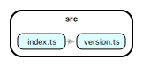

### installing & running

- install: `npm install`
- build (to verify typescript thinks everything is hunky-dory): `npm run build`
- verify dependency-cruiser can find the aliased dependency:

short: `npm --silent run depcruise:text`

```
src/index.ts → src/version.ts
```

long: `npm -silent  run depcruise:json`

<details>
<summary>The resulting JSON (click to expand)</summary>

```json
{
  "modules": [
    {
      "source": "src/index.ts",
      "dependencies": [
        {
          "dynamic": false,
          "module": "@version",
          "moduleSystem": "es6",
          "exoticallyRequired": false,
          "dependencyTypes": [
            "aliased",
            "aliased-tsconfig",
            "aliased-tsconfig-paths",
            "local",
            "import"
          ],
          "resolved": "src/version.ts",
          "coreModule": false,
          "followable": true,
          "couldNotResolve": false,
          "matchesDoNotFollow": false,
          "circular": false,
          "valid": true
        }
      ],
      "dependents": [],
      "orphan": false,
      "valid": true
    },
    {
      "source": "src/version.ts",
      "dependencies": [],
      "dependents": ["src/index.ts"],
      "orphan": false,
      "valid": true
    }
  ],
  "summary": {
    "violations": [],
    "error": 0,
    "warn": 0,
    "info": 0,
    "ignore": 0,
    "totalCruised": 2,
    "totalDependenciesCruised": 1,
    "optionsUsed": {
      "baseDir": "/Users/sverweij/dependency-cruiser-repro-repo/909",
      "combinedDependencies": false,
      "doNotFollow": {
        "path": "node_modules"
      },
      "enhancedResolveOptions": {
        "exportsFields": ["exports"],
        "conditionNames": ["import", "require", "node", "default", "types"],
        "mainFields": ["module", "main", "types", "typings"]
      },
      "exoticRequireStrings": [],
      "externalModuleResolutionStrategy": "node_modules",
      "metrics": false,
      "moduleSystems": ["es6", "cjs", "tsd", "amd"],
      "outputTo": "-",
      "outputType": "json",
      "preserveSymlinks": false,
      "rulesFile": ".dependency-cruiser.js",
      "tsConfig": {
        "fileName": "tsconfig.json"
      },
      "tsPreCompilationDeps": true,
      "args": "src"
    },
    "ruleSetUsed": {
      "forbidden": [
        {
          "name": "not-to-unresolvable",
          "from": {},
          "to": {
            "couldNotResolve": true
          },
          "severity": "warn",
          "scope": "module"
        }
      ]
    }
  }
}
```

</details>

### graph

[](./graph.svg)
